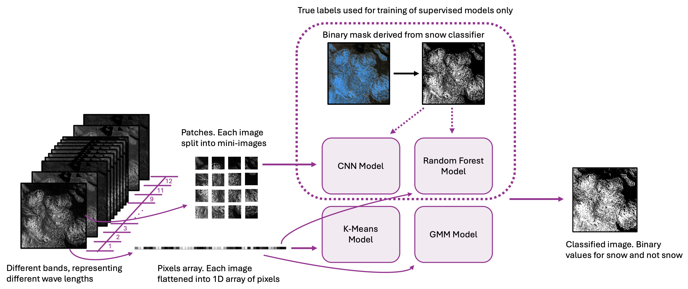
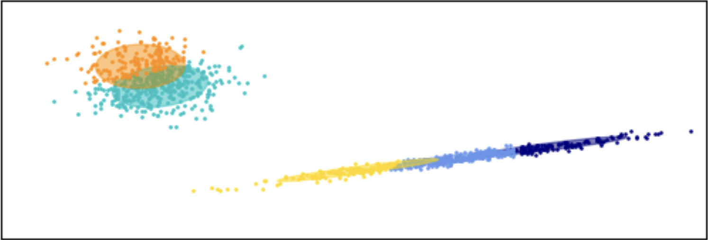
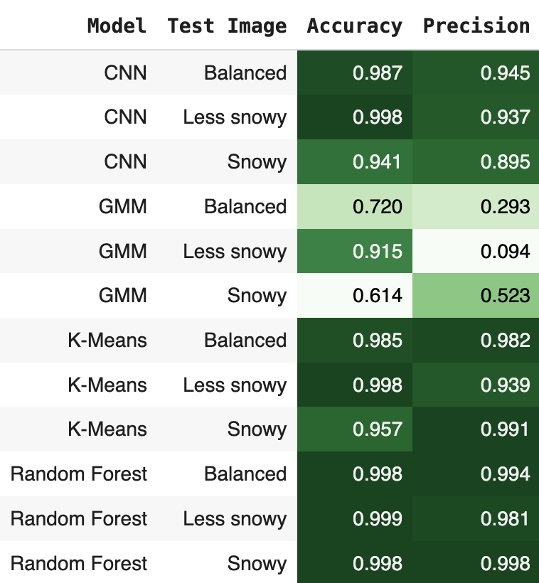

# Snow Cover Classification

This notebook explores snow cover classification based on earth observations with four machine learning (ML) models. Two of the models are supervised classifiers and two of the models are unsupervised classifiers. Detailed descriptions of the data and model used are provided later in this Readme. 

## Table of contents
1. [Running the Notebook](#running)
2. [Data](#data)
3. [Models](#models)
4. [Results and Conclusions](#results)
5. [Acknowledgements](#acknowledgements)


## Running the Notebook  <a name="running"></a>

The code in this repository is developed and ran with Google Colab. You can run the code on your own machine or with anouther cloud service. However, that might require installations and setup to make the environment compatible. 

The first thing you need to do to run the code on your Google Drive is to clone the repository. This is easiest done by creating a new Colab on your Google Drive and run the following line from a cell.

```python
! git clone https://github.com/bara-sara/GEOL0069-Project.git
```
You can also clone or download the repository to your local machine and upload manually to your Google Drive.

### Using Other Satellite Images
You can replace the images used in this notebook with images covering other areas or from other dates. Satellite images are downloaded from browser.dataspace.copernicus.eu. In order to download images, you need an account, which you will be promted to create/login to when you enter the website. Thereafter, select Sentinel-2 L2A and go to an area of your interest. Make sure that there is not too much cloud covering the images. Thereafter, press on download image on the bar to the right and select all of the raw bands, plus the treue color and snow classifier. Choose format TIFF and medium resolution. Keep in mind that hte images must have at least 400x800 pixels, or you have to adjust the selected extent in the code.


## Data <a name="data"></a>
### Study Area
The images used in this notebook covers parts of Jämtland in Sweden. The area is high latitude and alpine, with snow still covering the mountains in early summer. However, climate change with it's increasing temperatures, rising more than average in Scandinavia, will result in snow melting earlier. 

### Data Source
This notebook utilizes Sentinel 2 image retrieved from Copernicus website. 12 raw bands are used as input to the models, specifically band 1, 2, 3, 4, 5, 6, 7, 8, 8A, 9, 11 and 12. Whilst input data is sufficient for the unsupervised models, the two supervised models need a true label. In this experiment, the snow classifier product is used. There are caveats with using the the snow classifier product as true label, mainly because it is derived from the raw bands, which implies a risk that biases in the Sentinel 3 Snow Classifier may be reproduced. However, there are major advantages with using the classifier, not the least labeled images in locations worldwide. This approach makes it easy to use the same notebook for another study area, by simply downloading another set of raw bands and snow classifier images from Copernicus.

The snow classifier images is not adopted directly, but is used to create a binary mask. This mask is an image consisting of 0 and 1, 1 representing snow and 0 representing not snow. Additionally, images with true color are used to manually verify that the mask is accurate.


### Dataset
Three images, covering the same area but for different dates, are used in this notebook. All of the three images have less than 10% cloud coverage. One date, 2021-05-30, is selected to train the model because of it's relatively balanced share of snow and not snow. In addition to this balanced image, one image with most of the image covered with snow and one image with sparse snow coverage, are used for evaluation. This, in order to assess the models ability to classify snow for less balanced images. 

All of the three images are split into train and test images. It is common to create train and test datasets with random splits of patches, yet this experiment splits the original image in half into two complete images. This, in order to enable reconstruction of the predicted image for evaluation. Since only the balanced image is used for training, the snowy and less snowy images only use the test part.

Unsupervised models do not necessarily require seperate train and test datasets. Still this notebook uses the training image to define the clusters, which is later applied on the test images to evaluate the performance more fairly agains the supervised models.

One of the models, the CNN model, is fed with patches. Patches are small sub-images with a size of only a few pixels. The other models are simply fed with flatten images.

## Models <a name="models"></a>
The four models assessed in this notebook are
1. Convolutional Neural Network (CNN)
2. Random Forest
3. K-Means
4. Gaussian Mixture Model (GMM)



### Supervised Models

Supervised ML models utilizes labeled training data, meaning that input data has corresponding true labels.

#### CNN
CNNs distinguish from other neural networks in their adoption of convolutional filters. The convolutional filters enable the model to learn contextual information, since pixels are processed together woth their neighbourghs.


#### Random Forest

The Random Forest algorithm is is an ensemble method based on decision trees. In contrast to traditional decision trees, a Random Forest model includes multpile trees that are trained with bootstrap sampling. When predicting, the majority vote among the decision trees is the projected label. More information about scipy's Random Forest algorithm, implemented in the notebook, can be found [here](https://scikit-learn.org/stable/modules/ensemble.html#random-forests-and-other-randomized-tree-ensembles).


### Unsupervised Models

Unsupervised models classifies data without true labels, but only by identifying similarities among the input samples and clustering the data accordingly.

#### K-Means

The K-Means algorithm initializes random cluster centers, centroids, and thereafter assigns samples to the closest centroids, measured by eucledian distance. The location of the controids are thereafter set to the mean of the samples in that cluster. The assignment of clusters and update of centroids is repeated until the cluster members doesn't change. This study implements the scipy's K-Means algorithm, and more information about the algorithm and parameters can be found [here](https://scikit-learn.org/stable/modules/generated/sklearn.cluster.KMeans.html).


#### Gaussian Mixture Model

A GMM is an unsupervised probabilistic model that fits a number of Gaussian distribution curves based on inputed data. The combination of distributions are then used to classify data.. This study implements the scipy's GMM algorithm, and more information about the algorithm and parameters can be found [here](https://scikit-learn.org/stable/modules/mixture.html).



## Results and Conclusions  <a name="results"></a>

All of the models classified the balanced test image, which was most similar to the training images, reasonably well. Yet the performance decreased significantly for the images with either more or less snow, especially in terms of precision. Overall, the K-Means algorithm was more accurate and precise on avaerge for the three images. This might seems surprising, since it is the most simple algorithm of the four included in the notebook. A likely explanation is that the Sentinel-2 Snow Classifier, on which the true labels used for training and evaluation is based, is defined based on a quotient of bands. Hence the relation is non-linear but still quite simple, and it might be that the CNN, which is non-linear and has many degrees of freedom produces an overcomplicated algorithm. The training of the CNN is interrupted when the validation accuracy is not improved by more than 0.5%, and even though the training, validation and testing accuracies are quite similar, the model might be overfitted given the low performance with the less snowy and snowy images. 

A natural improvement would be to use training data from images with different snow coverage. Moreover, one could use a manually classified mask as true label, in order to prevent reproducing potential biases in the Sentinel-2 Snow Classifier. 




## Environmental Impact
Enhanced computational resources and cloud services have enabled running more computationally demanding processes and thereby opened doors to new technologies. However, as traditionally heavy computations are more accessible, such as AI services, their carbon footprint is becoming an increasing concern. The most important environmental impacts of this project can be summerized as:
1. Energy for running the code
2. Environmental impact related to production of hardware, both Google's and my personal device
3. Environmental impact related to the Sentinel 2 products

#### Energy Consumption
Lannelongue et al. (2021) presented a framework to estimate the carbon footprint from computational tasks. The framework presented in their study was further used to develop an online tool for estimations at www.green-algorithms.org/. Some information requested when estimating the carbon footprint is not stated on Google Colab's website, the could service employed in this project. Specifications with substantial impact on the carbon footprint that are unknown include CPU model and geographical location of the servers used. The estimation with the available information results in an energy consumption about 100 Wh for 1 hour runtime. The carbon footprint of such energy consumption is further highly dependent on the location of the servers due to differences in energy sources, with potential values approximately in the range 10 to 100 gram CO2 equivalents (gCO2e). The runtime for running all cells in the notebook is arther about 5 minutes, thus yielding a range closer to 1 to 20 gCO2e, yet it is likely that the development of the projected has more than 1 hour accumulated runtime. To put these values in relation to everyday activities, one run through the notebook consumes a similar number of Wh as charging one iPhone [(Macworld, 2025)](https://www.macworld.com/article/678413/iphone-battery-capacities-compared-all-iphones-battery-life-in-mah-and-wh.html), which corresponding gCO2e depends on what energy source is used for charging. In addition to the energy consumption to run the servers, my personal device, as well as a Wi-Fi router also contributes to the carbon footprint.

#### Environmental Impact From Hardware
The environmental impact from hardware is harder to estimate, since both the servers as well as my own device are used for multiple purposes, and the lifetime of a server as well as its utilization remains uncertain. In addition to the carbon footprint, hardware has substantial impact on other environmental aspects, such as pollution and biodiversity, related to extraction of raw materials. 

#### Environmental Impact From Sentinel-2 Products
Similar to the estimation of the carbon footprint from the computer hardware, the Sentinel 2 products are used over long time and for a wide range of purposes. This project uses Sentinel 2 images from three date over a very limited geographic area, which is neglectible in relation to all data available and used from Sentinel 2. Still, this project could not have been carried out without these product. Satellites emit substantial amounts of CO2e when launched, whilst the continuing emissions are neglectible [(LiveEO, 2022)](https://www.live-eo.com/article/how-green-is-satellite-monitoring-lets-do-the-math#satellite-emissions-are-one-off). In addition to launching the satellite, production related environmental costs, both in terms of CO2e and material related impacts.

#### Summary
The code developed in this project may be used to improve the understanding of the decreasing snow coverage in Sweden as climate change proceeds, and thus serve as a motivation. However, no actions to combat climate change are undertaken or planned related to this particular project, meaning that there is no direct positive impact on climate change. At the same time, this project has consumed energy and caused degradation of the hardware, and thus has a negative impact on climate change. The energy consumed and degradation of hardware is, still, small in relation to everyday activities. This project is by no means pivotal for the trade of whether the production of Sentinel-2 and my personal device can be justified from an environmental perspective. Since this project is part of a university course, the environmental costs must be assessed in relation to the knowledge achieved by developing the project. Given the neglectible energy consumption, in relation to everyday activites, I would argue that this project can be justified.


L. Lannelongue, J. Grealey, M. Inouye, Green Algorithms: Quantifying the Carbon Footprint of Computation. Adv. Sci. 2021, 8, 2100707. https://doi.org/10.1002/advs.202100707


## Acknowledgements  <a name="acknowledgements"></a>